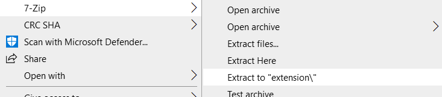

# mangadex2cubari

Chrome extension for redirecting MangaDex/Imgur URLs to their Cubari complement.

## Installation

This extension has to be loaded as an unpacked extension because I don't want to pay $5 to register as a developer on the Chrome Web Store.

1. Find the latest release on [the Releases page](https://github.com/jasonjewik/mangadex2cubari/releases. Download extension.zip under the "Assets" tab.

   

2. Unzip extension.zip.

   

3. Go to Chrome's [extension manager](chrome://extensions). Click the button titled "Load unpacked" in the upper left corner. Select the folder that you unzipped in Step 2.

   

## Usage

Right-click on the link and select "Open with Cubari" in the context menu.

